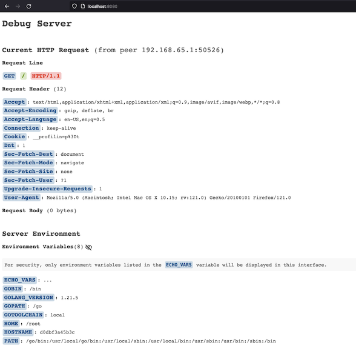

# echo - HTTP Server Environment Debugger

`echo` accepts any request and responds with with `200 OK`. The response payload
is a web page which displays information about the request and the server
environment.

All requests to the server are logged as JSON.

## Features

The `echoserver` provides:

- __Request debugging__ by dumping the HTTP request as received by the server both
  to the UI, and as JSON-encoded log entries for debugging when the browser
  cannot reach the server.

- __Server Environment debugging__ by dumping a user-configurable subset of the
  server environment.

### Environment Debugging

By default, the server will not dump any of the environment. To enable this, the
environment variable `ECHO_VARS` must be set to a space-separated list of the
environment variables you wish to expose to HTTP requests. Alternatively, you
can set `ECHO_VARS=...` (a literal "...") to instruct the server to dump all
environment variables. You should probably __never ever do that in production__,
but if you do, it's not my fault.

Here is a screen shot of what the server returns for a `GET` request after being
started with `docker run --rm -p 8080:8080 -e ECHO_VARS='...'
cfunkhouser/echoserver:latest`.



## Running It

You can run the server directly from this repository. Following is a manual
execution, displaying the startup log and a dump of a single request.

```console
$ go run ./cmd/echoserver
go run ./cmd/echoserver
{"time":"2024-01-11T10:07:10.189852-07:00","level":"INFO","msg":"Server starting","address":":8080"}
{"time":"2024-01-11T10:07:15.552663-07:00","level":"INFO","msg":"incoming request","request":{"requestor":"127.0.0.1:50175","method":"GET","target":"/","protocol":"HTTP/1.1","headers":[{"name":"Accept","value":"text/html,application/xhtml+xml,application/xml;q=0.9,image/avif,image/webp,*/*;q=0.8","index":0,"repeat_count":1},{"name":"Accept-Encoding","value":"gzip, deflate, br","index":0,"repeat_count":1},{"name":"Accept-Language","value":"en-US,en;q=0.5","index":0,"repeat_count":1},{"name":"Connection","value":"keep-alive","index":0,"repeat_count":1},{"name":"Cookie","value":"__profilin=p%3Dt","index":0,"repeat_count":1},{"name":"Dnt","value":"1","index":0,"repeat_count":1},{"name":"Sec-Fetch-Dest","value":"document","index":0,"repeat_count":1},{"name":"Sec-Fetch-Mode","value":"navigate","index":0,"repeat_count":1},{"name":"Sec-Fetch-Site","value":"none","index":0,"repeat_count":1},{"name":"Sec-Fetch-User","value":"?1","index":0,"repeat_count":1},{"name":"Upgrade-Insecure-Requests","value":"1","index":0,"repeat_count":1},{"name":"User-Agent","value":"Mozilla/5.0 (Macintosh; Intel Mac OS X 10.15; rv:121.0) Gecko/20100101 Firefox/121.0","index":0,"repeat_count":1}]}}
{"time":"2024-01-11T10:07:15.601182-07:00","level":"INFO","msg":"incoming request","request":{"requestor":"127.0.0.1:50175","method":"GET","target":"/favicon.ico","protocol":"HTTP/1.1","headers":[{"name":"Accept","value":"image/avif,image/webp,*/*","index":0,"repeat_count":1},{"name":"Accept-Encoding","value":"gzip, deflate, br","index":0,"repeat_count":1},{"name":"Accept-Language","value":"en-US,en;q=0.5","index":0,"repeat_count":1},{"name":"Connection","value":"keep-alive","index":0,"repeat_count":1},{"name":"Cookie","value":"__profilin=p%3Dt","index":0,"repeat_count":1},{"name":"Dnt","value":"1","index":0,"repeat_count":1},{"name":"Referer","value":"http://localhost:8080/","index":0,"repeat_count":1},{"name":"Sec-Fetch-Dest","value":"image","index":0,"repeat_count":1},{"name":"Sec-Fetch-Mode","value":"no-cors","index":0,"repeat_count":1},{"name":"Sec-Fetch-Site","value":"same-origin","index":0,"repeat_count":1},{"name":"User-Agent","value":"Mozilla/5.0 (Macintosh; Intel Mac OS X 10.15; rv:121.0) Gecko/20100101 Firefox/121.0","index":0,"repeat_count":1}]}}
```

You can install it directly, and run it:

```console
$ go install idontfixcomputers.com/echo/cmd/echoserver@latest
go: downloading idontfixcomputers.com/echo v0.1.1
$ which echo
/home/whatever/bin/echo
$ echo --help
Usage of echo:
  -address string
        Bind address in host:port format. (default ":8080")
$ echo --address 127.0.0.1:9000
{"time":"2024-01-11T10:07:10.189852-07:00","level":"INFO","msg":"Server starting","address":":8080"}
```

### Docker

A Docker image is published to `cfunkhouser/echoserver` tagged with each
release. It can be run with `docker run --rm -p 8080:8080
cfunkhouser/echoserver:latest`.
